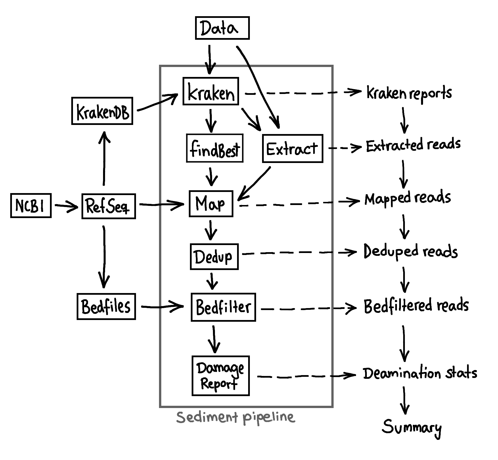

# Quicksand


**Quicksand**: Quick analysis of sedimentary ancient DNA \
Please see https://mpieva.github.io/quicksand for a **comprehensive documentation**.

## Description
quicksand is a bioinformatic pipeline for the analysis and taxonomic binning of target enriched ancient mammlian mitochondrial sedimentary DNA (sedaDNA).
With the general workflow and background described in [_Slon et al., 2017_](https://science.sciencemag.org/content/sci/suppl/2017/04/26/science.aam9695.DC1/aam9695_SM.pdf), quicksand uses [krakenuniq](https://doi.org/10.1186/s13059-018-1568-0) for the classification of reads and is optimized for speed and reusability. The pipeline is written in [Nextflow](https://doi.org/10.1038/nbt.3820) and requires [Singularity](https://doi.org/10.1371/journal.pone.0177459).

<p align=center>
    
</p>

#### Input
- Demultiplexed, trimmed and overlap-merged reads in either `READGROUP.bam` or `READGROUP.fastq` format.

#### Output

- For each readgroup, processed and binned reads in `.bam`-format at each stage of the pipeline (see workflow above). 
- Summary statistics for each readgroup and assigned family: Number of assigned reads, mapped reads, deduplicated (unique) reads, bedfiltered reads, the estimated DNA-damage, proportion within that readgroup 

## Quickstart
### Requirements

To run the pipeline, please install
 - Nextflow
 - Singularity

### Create Datastructure

Open your terminal and type:

```bash
    mkdir quickstart && cd quickstart
    nextflow run mpieva/quicksand-build --outdir refseq
```
    
### Run quicksand

For the run, we need some data: For that we download the Hohlenstein-Stadel mtDNA (please see the [README](http://ftp.eva.mpg.de/neandertal/Hohlenstein-Stadel/README))

```bash
    wget -P split http://ftp.eva.mpg.de/neandertal/Hohlenstein-Stadel/BAM/mtDNA/HST.raw_data.ALL.bam
```
    
And run the quicksand pipeline:

```bash
    export NXF_OPTS="-Xms128g -Xmx128g"
    nextflow run mpieva/quicksand \
        --db        refseq/kraken/Mito_db_kmer22 \
        --genome    refseq/genomes \
        --bedfiles  refseq/masked \
        --split     split \
        --report    \
        --analyze   
```
