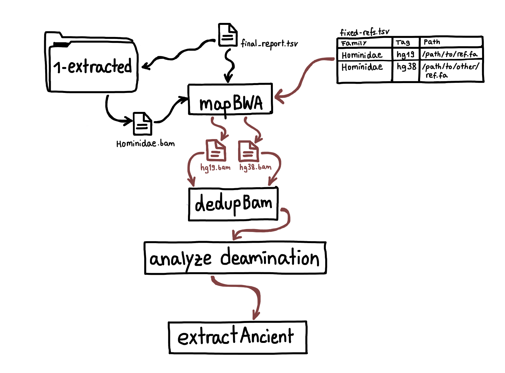

Pipeline
========

.. image:: images/v2.0.png
	:width: 800
	:align: center
	:alt: Graphical overview of the quicksand and quicksand-build pipeline

This page gives an overview of the workflow implemented in quicksand, as illustrated in the figure above.

Workflow
--------

quicksand (quick analysis of sedimentary ancient DNA) is an open-source Nextflow [1]_ pipeline designed for 
rapid and accurate taxonomic classification of mammalian mitochondrial DNA (mtDNA) in aDNA samples. 
quicksand combines fast alignment-free classification using KrakenUniq [2]_ with downstream mapping (BWA [3]_), post-classification filtering, and ancient 
DNA authentication. quicksand is optimized for speed and portablity and requires either Singularity or Docker.

The input for quicksand is a directory with user-supplied files in BAM or FASTQ format. 
Adapter-trimming, overlap-merging and sequence demultiplexing need to be performed by the user prior to running quicksand. 

The required KrakenUniq database, the reference genomes for mapping and the bed-files for low-complexity filtering are available on the 
MPI EVA FTP Servers. Custom versions of the reference material can be created with the quicksand-build pipeline
(see :ref:`_quickstart-page`)

Filtering
"""""""""

Before classification, quicksand removes sequences from the files that are too short for mapping (default: 35bp). 
This threshold is set with the :code:`--bamfilter_length_cutoff N` flag.

In addition, sequences are filtered by their respective BAM filterflag (`See here <https://broadinstitute.github.io/picard/explain-flags.html>`_). By default,
unpaired sequences are removed from each input file (flag: 1). The value is set with the :code:`--bamfilterflag N` flag.

Taxonomic classification
""""""""""""""""""""""""

Sequences are then classified by the alignment-free classifier KrakenUniq. For the analysis of ancient mitochondrial DNA (mtDNA), 
quicksand uses a KrakenUniq database created from all mtDNA genomes published in NCBI RefSeq, indexed with a kmer-size of 22.

To remove background-identifications, family-assignments are removed from downstream-analyses if they fall below a minimum number of 
sequences per family (:code:`--krakenuniq_min_reads N`, default: 3) and a minimum number of unique kmers per family
(:code:`--krakenuniq_min_kmers N`, default: 129).

For each family passing these filters, sequences are binned and written to file. 
Then, a “best” reference for that family is selected for the upcoming mapping step
based on the number of unique kmers in the lower hierarchies. quicksand implements a naive decision tree, following the path of the highest kmer counts down the 
taxonomic tree from the family to the species level.

To bin sequences on the order- instead of the family-level, quicksand can be run with the :code:`--taxlvl o` flag.

Mapping and Deduplication
"""""""""""""""""""""""""

The binned family or order-level sequences are then mapped against all the "best" reference genomes found before.

For mapping quicksand uses the `network-aware fork <https://github.com/mpieva/network-aware-bwa>`_ of BWA with
"ancient" parameters (:code:`n 0.01 -o 2 -l 16500`).

For the downstream processes, unmapped sequences and sequences with a that show a mapping quality of less than the 
specified :code:`--bamfilter_quality_cutoff N` (default: 25) are removed from the alignment.

In each alignment, sequence duplicates are collapsed into unique molecules using `bam-rmdup <https://github.com/mpieva/biohazard-tools>`_.
This process relies on shared start and end coordinates in the alignment. If multiple reference genomes were found for mapping, only a single 
"best" genome is selected for downstream processes, based on the highest number of covered basepairs in the alignment.

The deduplicated alignments are then depleted of reads that overlap sites marked as non-informative by dustmasker [4]_.

DNA Deamination Stats
"""""""""""""""""""""

Finally, the deduplicated alignments are analyzed for DNA deamination patterns by counting C-to-T substitutions in the aligned sequences
compared to the reference genome.

Deamination is a chemical process that removes amino groups from DNA bases over time, causing cytosine (C) to uracil (U) conversion, 
especially at the terminal positions of DNA strands. When sequenced, uracil is paired with thymine (T) and these modifications appear 
as C-to-T (or G-to-A) substitutions, characteristic for aDNA sequences.

By default quicksand counts C-to-T substitutions on both ends of the DNA sequences, as obtained for data that went through a single-stranded
library preparation. Use the :code:`--doublestranded` flag to count the G-to-A substitutions at the 5' instead,
as observed in libraries prepared with a double-stranded protocol.

The significance of the deamination signals are indicated as follows:

(++) C-to-T substitutions frequencies on both ends of sequences are significantly higher than 10% (i.e., the lower limit of the 95% 
binomial confidence exceeds 10%). Sequences in this category are considered to originate at least partly from authentic aDNA. 

(+) C-to-T substitution frequencies on either the 5’ or 3’ end of sequences (but not both) are significantly higher than 10%. 
These values could mean low to medium damage, as expected from Holocene samples or not sufficiently significant evidence for the 
presence of authentic older aDNA. It is used to indicate that aDNA may be present and that the analysis may be under-powered. 

(-) C-to-T substitutions frequencies at neither the 5’ nor the 3’ end significantly exceed 10%, indicating that evidence for the 
presence of aDNA is lacking for the respective family.

Fixed References
-----------------

In a default run, sequences are mapped to a single final reference genome per detected family. 
However, users may require alignments to one or multiple specific reference genomes per family. To address this, quicksand allows users 
to pre-set references for mapping after the KrakenUniq classification with the :code:`--fixed TSV` flag.

When such pre-set (“fixed”) references are used, quicksand skips low-complexity filtering (unless the `--fixed_bedfiltering` flag is set) 
and adds an additional step in the workflow, in which putatively deaminated sequences are saved to a separate file.

Rerun
------

The :code:`--rerun` flag provides an
alternative entry-point into the the pipeline and starts the workflow *after* the KrakenUniq step. The :code:`--rerun` flag works only
together with the :code:`--fixed` flag. In this mode, quicksand takes the binned reads and remappes them with to the genomes specified.

During a rerun, quicksand imports the final report file and overwrites it at the end. Only families are reanalyzed for which binned reads exist already.

References
""""""""""

.. [1] Di Tommaso, P., Chatzou, M., Floden, E. et al. Nextflow enables reproducible computational workflows. Nat Biotechnol 35, 316–319 (2017). https://doi.org/10.1038/nbt.3820
.. [2] Breitwieser, F.P., Baker, D.N. & Salzberg, S.L. KrakenUniq: confident and fast metagenomics classification using unique k-mer counts. Genome Biol 19, 198 (2018). https://doi.org/10.1186/s13059-018-1568-0
.. [3] Heng Li, Richard Durbin, Fast and accurate short read alignment with Burrows–Wheeler transform, Bioinformatics, Volume 25, Issue 14, July 2009, Pages 1754–1760, https://doi.org/10.1093/bioinformatics/btp324
.. [4] Morgulis, Aleksandr, E. Michael Gertz, Alejandro A. Schäffer, and Richa Agarwala. 2006. “A Fast and Symmetric DUST Implementation to Mask Low-Complexity DNA Sequences.” Journal of Computational Biology 13 (5): 1028–40. https://doi.org/10.1089/cmb.2006.13.1028.