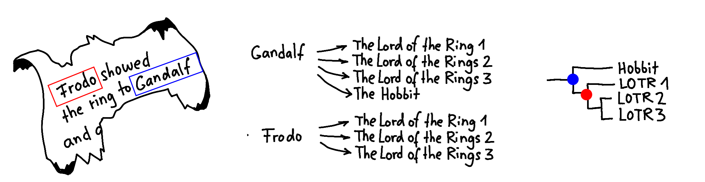
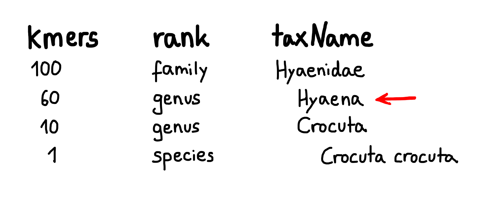
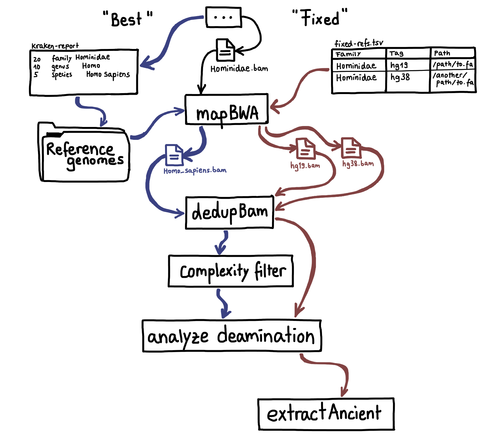

Pipeline
========

.. image:: images/v2.0.png
	:width: 800
	:align: center
	:alt: Graphical overview of the quicksand and quicksand-build pipeline

This page provides an overview of the workflows implemented in the quicksand pipeline, as illustrated in the figure above.

While the quicksand pipeline is dedicated to processing DNA sequencing data, the quicksand-build pipeline is used for customizing the underlying databases.
Outputs from the quicksand-build pipeline, like the kraken-database, the reference genomes and the :file:`bed` files for masking non-informative positions are prerequisites for quicksand.

For a detailed overview of the quicksand-build pipeline, see the :ref:`quicksand_build-page` page.

Workflow
--------

Quicksand is a nextflow [1]_ pipeline, developed for the analysis of target-enriched sedimentary ancient DNA.

The basic workflow of the quicksand pipline comprises multiple subworkflows: filtering, metagenomic classification, mapping/deduplication, and basic DNA damage analysis
of the alignments. quicksand generates taxonomic profiles for each of the analyzed input files, along with the binned bam files for each step.

The pipeline requires as input demultiplexed, adapter-trimmed and overlap-merged DNA sequences.

filtering
"""""""""

In the filtering stage, quicksand takes measures to ensure a smooth execution of the pipeline. It also removes sequences from the files that are non-mappable
because of their sequence length, as specified by the :code:`--bamfilter_length_cutoff` threshold (default: 35bp).

If the input comprises :file:`fastq` files, they undergo conversion to unpaired and unmapped :file:`bam` files, a necessary step for subsequent processes.
Input :file:`bam` files are filtered by default to eliminate paired-end reads.

Metagenomics classification
""""""""""""""""""""""""""

Sequences are classified by the metagenomic classifier KrakenUniq [2]_. which operates as a kmer-based classifier.
In simple terms, each sequence is broken into smaller chunks of length k (kmers). These informative kmers are then matched against a database to
identify the taxa associated with each kmer.

The example above illustrates how kmer-based classification works. Imagine a sentence on a page and the task to find the book it's from.
Each word corresponds to a kmer, so all words are checked in a database and linked to books where the word appears in. Common words that appear
in all books are removed, leaving only `informative` words for the classification. Relating the found references in a tree, allows for the
assignment of sentences to a node in the given tree.

For the analysis of mitochondrial DNA sequences quicksand uses KrakenUniq with a database created from the non-redundant mtDNA NCBI RefSeq release
with a kmer size of 22.

KrakenUniq is fast and allows for a sorting of all input sequences into taxonomic families. To avoid false-positive assignments, families are
removed from the results if they fall below the minimum number of reads per family (:code:`--krakenuniq_min_reads`) and the minimum number of family-kmers (:code:`--krakenuniq_min_kmers`).
For each family reported by KrakenUniq, the node with the highest number of assigned unique kmers is picked as the reference-node for that family.

the example shows how the report is parsed. For the Hyaenidae family, the Hyaena node is picked as reference even though a species level
assignment is present for another genus.

For the mapping step, all sequences assigned to a particular family (or order) are gathered into a new :file:`bam` file.
One can choose whether this gathering happens on the family or order level by using the :code:`--taxlvl` flag.

Mapping and Deduplication
"""""""""""""""""""""""""

The sequences extracted for each family or order are mapped against all the reference genomes of species belonging to the reference-node found with KrakenUniq
for the given family or order. For instance, in the example above, they are mapped against all Hyaena species in RefSeq.

For mapping quicksand utilizes the `network-aware fork <https://github.com/mpieva/network-aware-bwa>`_ of BWA [3]_ with
ancient parameters (:code:`n 0.01 -o 2 -l 16500`).

For the downstream processes, unmapped sequences and sequences with a mean mapping quality of less than the specified :code:`--bamfilter_quality_cutoff` (default: 25)
are removed from the alignment.

In each alignment, exact sequence duplicates are collapsed into unique sequences using `bam-rmdup <https://github.com/mpieva/biohazard-tools>`_.
This process relies on shared start and end coordinates in the alignment. For cases where the reference-node is rank genus or higher, the
most representative species is chosen by comparing all the alignments. The species with the highest numbers of basepairs covered in the alignment
is picked as *best* species for the next steps.

The deduped alignments are then depleted of reads that overlap sites marked as non-informative by dustmasker [4]_. That step is skipped
for families with a fixed reference genome (see :code:`--fixed` flag)

DNA Deamination Stats
"""""""""""""""""""""

In the last step of the pipeline, the deduplicated sequences are checked for C to T substitutions compared to the reference genome.
Ancient DNA exhibits C to T substitutions at the 3’ and 5’ ends of DNA fragments, a degradation pattern used to identify ancient DNA.
Families whose sequences show more than 10% of terminal C bases in the reference genome replaced by a T are flagged as ancient (++).

Best vs Fixed
""""""""""""""

Throughout the run quicksand distinguishes between families with 'best' and 'fixed' references. fixed references are genomes specified with the :code:`--fixed`
flag, which assigns a specific reference genome for certain families. This overwrites the KrakenUniq reference-node.
Families with a fixed reference undergo a special treatment, skipping the bedtools intersect filter and going through additional analyses described below.

The image above shows the differences in the workflows. For the Hominidae reads found by KrakenUniq a reference is either picked by the pipeline (best) based
on the number of unique kmers as described above, or provided with a file and the :code:`--fixed` flag. Fixed references are not reduced to a single species per family.

Extract Ancient Sequences
""""""""""""""""""""""""""

For families with a fixed reference genome deaminated sequences are extracted. Then the quality score of the first and last 3 base pairs is masked by
setting the quality score to 0, and mpileup files are created.

References
""""""""""

.. [1] Di Tommaso, P., Chatzou, M., Floden, E. et al. Nextflow enables reproducible computational workflows. Nat Biotechnol 35, 316–319 (2017). https://doi.org/10.1038/nbt.3820
.. [2] Breitwieser, F.P., Baker, D.N. & Salzberg, S.L. KrakenUniq: confident and fast metagenomics classification using unique k-mer counts. Genome Biol 19, 198 (2018). https://doi.org/10.1186/s13059-018-1568-0
.. [3] Heng Li, Richard Durbin, Fast and accurate short read alignment with Burrows–Wheeler transform, Bioinformatics, Volume 25, Issue 14, July 2009, Pages 1754–1760, https://doi.org/10.1093/bioinformatics/btp324
.. [4] Morgulis, Aleksandr, E. Michael Gertz, Alejandro A. Schäffer, and Richa Agarwala. 2006. “A Fast and Symmetric DUST Implementation to Mask Low-Complexity DNA Sequences.” Journal of Computational Biology 13 (5): 1028–40. https://doi.org/10.1089/cmb.2006.13.1028.