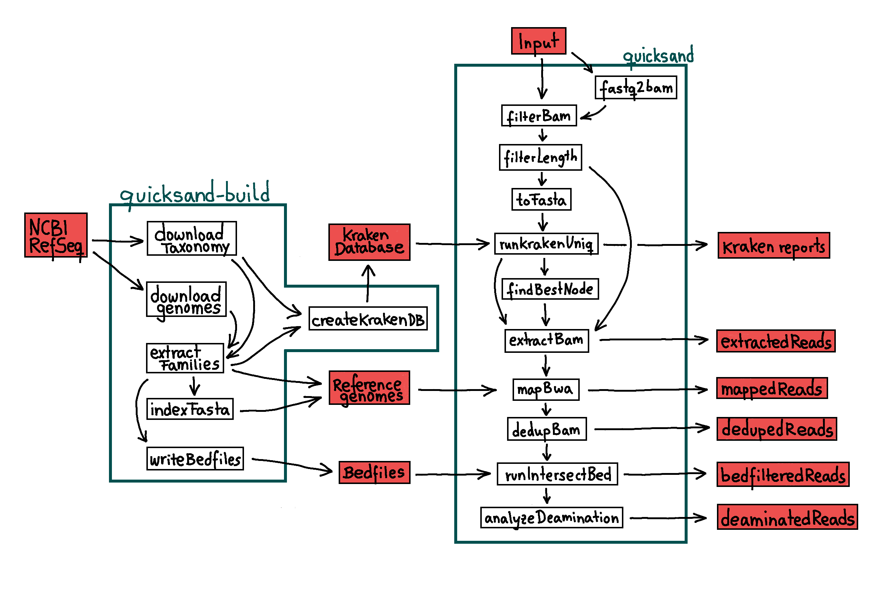

.. _quicksand_build-page:
.. role:: mono

quicksand-build
===============

Description
-----------

To run quicksand, an underlying datastructure with databases and reference genomes is required. This datastructure consists of:

- A preindexed Kraken-database
- A directory containing the indexed :file:`fasta` files of the mt-genomes from RefSeq that were used to create the kraken-database
- In the same directory, a file :file:`taxid_map.tsv`, linking the files in the folder to NCBI Taxonomy Ids
- A directory containing a :file:`bed`-file for each genome, indicating non-informative and low-complexity regions within the genome

Instead of creating this files manually, the supplementary pipeline quicksand-build is used for that. 
Note that quicksand-build is a **separate pipeline** hosted `here <https://github.com/mpieva/quicksand-build>`_.

Workflow
---------

downloadTaxonomy / downloadGenomes
""""""""""""""""""""""""""""""""""

The first step of the pipeline is downloading of the genbank-files from the `NCBI RefSeq mitochondrion FTP-Server<https://ftp.ncbi.nlm.nih.gov/refseq/release/mitochondrion/>`_ and
the NCBI taxonomy using the :code:`kraken-build --download-taxonomy` command. 

extractFamilies
""""""""""""""""

A custim python script is used to extract the fasta-files from the NCBI genbank files. Use the :code:`--include` flag to specify taxa that
should be extracted. (default: all). All included taxa are used to build the kraken-database and can thus be identified by the quicksand pipeline. 

indexFasta
""""""""""

The extracted :file:`fasta` files are indexed using the :code:`bwa index` command. 

writeBedfiles
""""""""""""""

For each :file:`fasta` file, :code:`dustmasker` is used to specify non-informative and low-complexity regions and write them
 as coordinates into a separate :file:`bed` file.

createKrakenDB
""""""""""""""

Use :code:`kraken-build` to add the extracted :file:`fasta` files to the database. The database is then built using the with the flag :code:`--kmers` specified kmer sizes 
(default: 22)

Usage
------

.. note::

	| quicksand-build uses singularity by default!
	| Use the :code:`-profile docker` flag to use docker instead. 

To run the pipeline with default parameters open the terminal and type::

	nextflow run mpieva/quicksand-build --outdir <PATH> [ --kmers KMERS --include TAXA --exclude PATH ]

Flags
"""""

.. list-table::
  :widths: 10 10 60
  :header-rows: 1
  
  * - Flag
    - Input type
    - Description

  * - :mono:`--outdir`
    - STRING
    - | Specify the directory
      | used to save the datastructure in
      | Default: 'out'

  * - :mono:`--include`
    - STRING
    - | A string of comma-separated taxa (exact match to the ncbi taxonomy names)
      | that should be included in the kraken database
      | Default: 'root' (all)
      ::

          Example:

          --include Mammalia,Aves

  * - :mono:`--kmers`
    - STRING
    - | A string of comma-separated numbers.
      | For each number a kraken database is built with the respective kmer-size
      | Default: '22'
      ::

          outdir
            ├── kraken
            │    ├── Mito_db_kmer22
            │    ├── Mito_db_kmer23
            │    └── Mito_db_kmer24
		  
		  Example:

          --kmers 22,23,24

  * - :mono:`--exclude`
    - PATH
    - | A TSV file containing family and comma-separated species names.
	  | The listed species are excluded from the kraken database
      ::

          input (exclude.tsv):
		
		  Hominidae	Homo_sapiens,Homo_neandertalensis
		  Bovidae	Capra_aegagrus
		  
		  Example:

          --exclude exclude.tsv

Output
-------

The output of quicksand-build is structured as follows::

	outdir
	├── kraken
	│    ├── Mito_db_kmer22
	│    │      ├── taxonomy
	│    │      ├── ...
	│    │      └── database.kdb
	│    └── Mito_db_kmer24
	│           ├── taxonomy
	│           ├── ...
	│           └── database.kdb
	├── genomes
	│    ├── ${Family}
	│    │      ├── ${Species}.fasta
	│    │      ├── ${Species}.fasta.fai
	│    │      └── ...
	│    └── taxid_map.tsv
	├── masked
	│    └── ${Species}.masked.bed
	├── ncbi
	│    └── raw gbff.gz files
	└── work
	     └── intermediate nextflow files

The :file:`taxid_map.tsv` file contains the following information::

	1425170  Hominidae   Homo_heidelbergensis              Primates
	9605     Hominidae   Homo_heidelbergensis              Primates
	9604     Hominidae   Homo_heidelbergensis              Primates
	9443     Hominidae   Homo_heidelbergensis              Primates
	63221    Hominidae   Homo_sapiens_neanderthalensis     Primates
	9605     Hominidae   Homo_sapiens_neanderthalensis     Primates
	9604     Hominidae   Homo_sapiens_neanderthalensis     Primates
	9443     Hominidae   Homo_sapiens_neanderthalensis     Primates
	9606     Hominidae   Homo_sapiens                      Primates
	9605     Hominidae   Homo_sapiens                      Primates
	9604     Hominidae   Homo_sapiens                      Primates
	9443     Hominidae   Homo_sapiens                      Primates
	741158   Hominidae   Homo_sapiens_subsp._'Denisova'    Primates
	9605     Hominidae   Homo_sapiens_subsp._'Denisova'    Primates
	9604     Hominidae   Homo_sapiens_subsp._'Denisova'    Primates
	9443     Hominidae   Homo_sapiens_subsp._'Denisova'    Primates

| The columns are "NCBI TaxonID", "Family", "Species", "Order"
| The species are represented in the file multiple times for different nodes.
| e.g. TaxId '9605' (Homo)
::

	9605  Hominidae  Homo_heidelbergensis            Primates
	9605  Hominidae  Homo_sapiens_neanderthalensis   Primates
	9605  Hominidae  Homo_sapiens                    Primates
	9605  Hominidae  Homo_sapiens_subsp._'Denisova'  Primates   

| The quicksand process 'findBestNode' returns a taxon id. This :file:`taxid_map.tsv` file is used to provide the 'mapBwa' process
| with all the species reference genomes linked to that TaxonId

.. note::

	In case of editing or manually building the datastructure, be aware that the $\\{Species\\} in the :file:`taxid_map.tsv` file must correspond to
	the $\\{Species\\} filenames in the :file:`genomes` and :file:`masked` directories. Otherwise quicksand won't find the appropriate files

